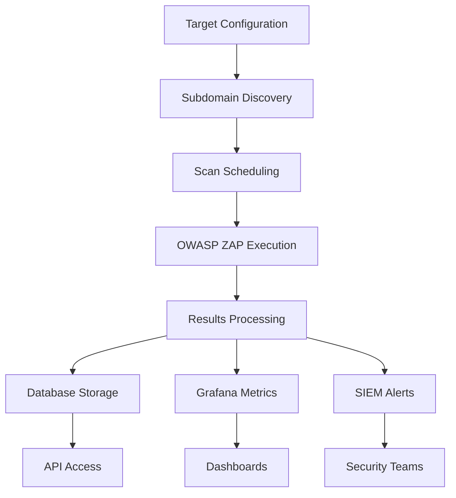

# DAST Monitor - System Architecture

## 📁 Directory Structure

```
audazz/                              # Root project directory
├── 🚀 main.py                       # Main application entry point
├── 📚 README.md                     # Project documentation
├── 🏗️ ARCHITECTURE.md              # This file - system architecture
├── ⚙️ .env.example                  # Environment configuration template
├── 📝 .gitignore                    # Git ignore rules
├── 📄 LICENSE                       # Project license
│
├── 📦 app/                          # Main application code
│   ├── __init__.py
│   ├── core/                        # Core business logic
│   │   ├── dast_monitor.py          # Main monitoring system
│   │   └── subdomain_discovery.py   # Subdomain enumeration
│   ├── api/                         # REST API endpoints
│   ├── integrations/                # External system integrations
│   │   ├── grafana_integration.py   # Grafana dashboards & metrics
│   │   └── siem_integration.py      # SIEM/SOAR integrations
│   ├── models/                      # Data models and schemas
│   └── utils/                       # Utility functions
│
├── ⚙️ config/                       # Configuration files
│   ├── dast_config.yaml             # Main application configuration
│   ├── grafana/                     # Grafana configurations
│   │   └── grafana_metric_config.json
│   ├── nginx/                       # Reverse proxy configuration
│   │   └── nginx.conf
│   ├── prometheus/                  # Metrics collection config
│   │   └── prometheus.yml
│   └── zap/                         # OWASP ZAP scan configurations
│       ├── automation_plan.yaml     # Standard scan automation
│       ├── automation_spa.yaml      # SPA scan automation
│       ├── automation_examples.yaml # Example configurations
│       └── policy_config.yaml       # ZAP security policies
│
├── 📊 data/                         # Application data storage
│   ├── reports/                     # Scan reports and results
│   │   └── .gitkeep
│   ├── logs/                        # Application logs
│   │   └── .gitkeep
│   └── exports/                     # Data exports
│
├── 🐳 deployment/                   # Deployment configurations
│   ├── docker/                      # Docker deployment
│   │   ├── docker-compose.yml       # Main Docker Compose file
│   │   ├── Dockerfile               # Application container
│   │   └── requirements.txt         # Python dependencies
│   └── kubernetes/                  # Kubernetes manifests (future)
│
├── 📊 monitoring/                   # Monitoring and observability
│   ├── dashboards/                  # Grafana dashboard definitions
│   └── alerting/                    # Alert rules and configurations
│
├── 🔐 security/                     # Security configurations
│   ├── certificates/                # SSL/TLS certificates
│   │   └── .gitkeep
│   └── policies/                    # Security policies
│
├── 🛠️ scripts/                     # Utility scripts
│   ├── setup/                       # Installation and setup
│   │   └── install.sh               # Automated installation script
│   └── maintenance/                 # Maintenance utilities
│       └── process_zap_metrics.py   # Legacy metrics processor
│
└── 🧪 tests/                        # Test suite
    ├── unit/                        # Unit tests
    └── integration/                 # Integration tests
```

## 🏗️ System Components

### Core Application (`app/`)

**`main.py`** - Application entry point
- Command-line interface
- Service initialization
- Configuration loading

**`app/core/dast_monitor.py`** - Main monitoring engine
- Continuous scanning orchestration
- Target management
- Scheduling and execution

**`app/core/subdomain_discovery.py`** - Subdomain enumeration
- Multi-tool subdomain discovery
- DNS verification
- Technology detection

**`app/integrations/`** - External integrations
- Grafana metrics and dashboards
- SIEM/SOAR alert forwarding
- CI/CD pipeline integration

### Configuration Management (`config/`)

**`dast_config.yaml`** - Main configuration
- Scan schedules and priorities
- Integration settings
- Performance tuning

**`config/zap/`** - OWASP ZAP configurations
- Automation plans for different scan types
- Security policies and rules
- Custom scan configurations

**`config/prometheus/`** - Metrics collection
- Scrape configurations
- Alert rules
- Service discovery

### Data Storage (`data/`)

**`data/reports/`** - Scan results
- JSON, HTML, XML report formats
- Historical scan data
- Vulnerability trending

**`data/logs/`** - Application logs
- Structured logging
- Audit trails
- Error tracking

### Deployment (`deployment/`)

**`deployment/docker/`** - Container deployment
- Multi-service Docker Compose
- Application containerization
- Infrastructure as code

### Security (`security/`)

**`security/certificates/`** - SSL/TLS certificates
- Production certificates
- CA certificates
- Certificate management

**`security/policies/`** - Security policies
- Access control policies
- Scan policies
- Compliance configurations

## 🔄 Data Flow



## 🔧 Key Design Principles

### 1. **Separation of Concerns**
- Core logic separated from integrations
- Configuration externalized
- Clear module boundaries

### 2. **Scalability**
- Containerized architecture
- Concurrent processing
- Resource management

### 3. **Observability**
- Comprehensive logging
- Metrics collection
- Health monitoring

### 4. **Security**
- Least privilege access
- Secure defaults
- Audit capabilities

### 5. **Maintainability**
- Clear documentation
- Standardized structure
- Automated deployment

## 🚀 Deployment Architecture

### Development Environment
```
Developer Machine
├── Local Docker Compose
├── SQLite Database
└── File-based Reports
```

### Production Environment
```
Production Infrastructure
├── Load Balancer (Nginx)
├── Application Cluster (Docker Swarm/K8s)
├── Database Cluster (PostgreSQL)
├── Cache Layer (Redis)
├── Monitoring Stack (Prometheus/Grafana)
└── Storage (Persistent Volumes)
```

## 📈 Scalability Considerations

### Horizontal Scaling
- Multiple scanner instances
- Load balancing
- Distributed task queuing

### Vertical Scaling
- Memory optimization
- CPU utilization
- I/O optimization

### Storage Scaling
- Report archiving
- Database sharding
- Object storage integration

## 🔒 Security Architecture

### Authentication & Authorization
- API token-based auth
- Role-based access control
- Audit logging

### Network Security
- TLS encryption
- Network segmentation
- Firewall rules

### Data Protection
- Encryption at rest
- Secure key management
- Backup encryption

## 📊 Monitoring Strategy

### Application Metrics
- Scan performance
- Error rates
- Resource utilization

### Business Metrics
- Vulnerability trends
- Coverage metrics
- Compliance status

### Infrastructure Metrics
- System health
- Network performance
- Storage utilization

---

This architecture provides a robust, scalable foundation for continuous DAST monitoring while maintaining security, observability, and operational excellence.